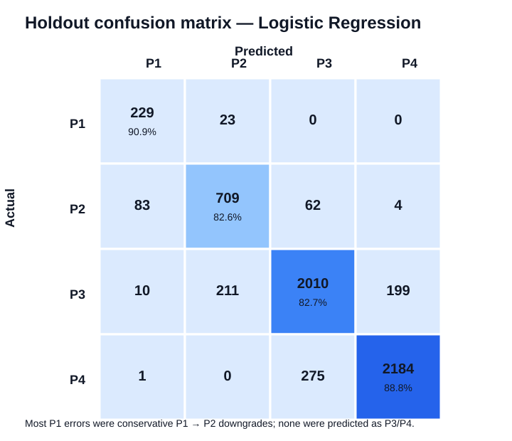
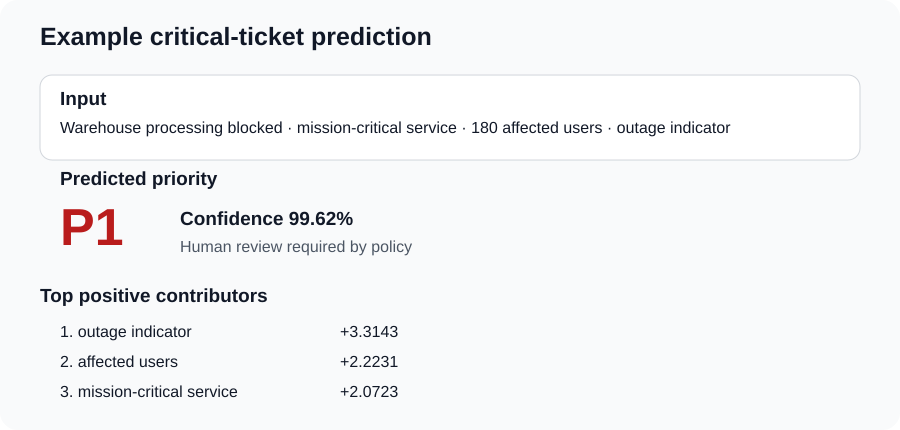
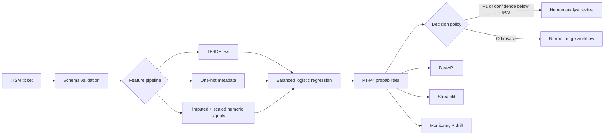
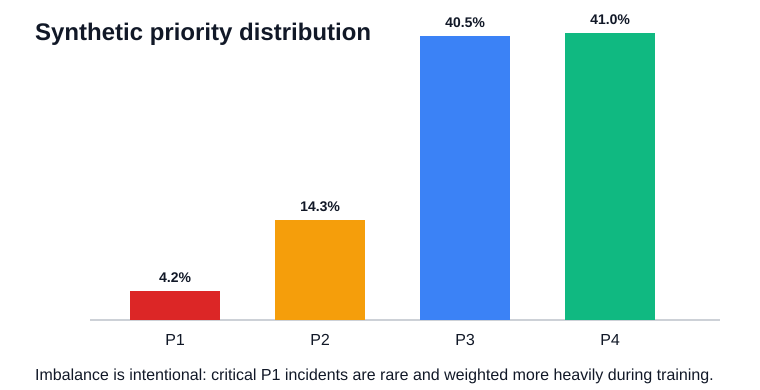

# AI-Powered IT Service Desk Priority Predictor

[](https://github.com/spawn187/ai-it-service-desk-priority-predictor/actions/workflows/ci.yml)
[](https://www.python.org/)
[](https://scikit-learn.org/)
[](https://fastapi.tiangolo.com/)
[](https://www.docker.com/)
[](LICENSE)

An end-to-end **machine learning engineering portfolio project** that predicts **P1-P4 priority** for IT service desk tickets using NLP and operational metadata.

This is deliberately more than a notebook: it includes reproducible synthetic data generation, data-quality controls, feature engineering, candidate-model comparison, explainable inference, FastAPI, Streamlit, Docker, automated tests, GitHub Actions, optional MLflow tracking, a model card, architecture documentation, and an interview talk track.

> **Privacy by design:** no real company, employee, customer, host, or service-desk data is included.

## Business problem

Manual ticket prioritization is slow and inconsistent. Missing a genuine P1 outage or security incident can delay escalation, while too many P1 assignments create alert fatigue. The system therefore optimizes for strong critical-incident recall while keeping a human analyst in control.

**Decision policy:** every predicted P1 and every prediction below 65% confidence requires human review.

## Reference results

The reproducible reference experiment uses **30,000 clean synthetic tickets** and a stratified **6,000-ticket holdout set**.

| Model | Accuracy | Macro F1 | P1 precision | P1 recall |
|---|---:|---:|---:|---:|
| **Balanced logistic regression** | **85.53%** | 83.16% | 70.90% | **90.87%** |
| SGD classifier | 84.30% | 81.36% | 69.30% | 90.48% |
| Linear SVM | 85.32% | **83.60%** | **75.85%** | 88.49% |

Logistic regression is selected because the operating requirement is not simply to maximize one leaderboard metric. It provides the strongest P1 recall among the high-performing candidates, native probabilities for confidence-based routing, inspectable coefficients, and inexpensive inference.




## Example prediction



A mission-critical warehouse outage is predicted as P1, but the API still sets `requires_human_review=true`. The model is a decision-support component, not an autonomous incident manager.

## Architecture



See [Architecture and Deployment Design](docs/ARCHITECTURE.md).

## Repository structure

```text
.
├── api/                         # FastAPI service
├── app/                         # Streamlit interactive demo
├── artifacts/                   # Reproducible reference metrics
├── assets/                      # Portfolio visuals
├── data/sample/                 # Small inspectable synthetic sample
├── docs/                        # Architecture, model card, report, interview notes
├── examples/                    # API request/response examples
├── models/                      # Model metadata; binary artifact generated locally
├── notebooks/                   # Exploratory analysis
├── scripts/                     # Data, training, evaluation, prediction CLIs
├── src/it_ticket_priority/      # Reusable Python package
├── tests/                       # Data, pipeline, inference, API tests
├── .github/workflows/ci.yml     # Lint, test, training smoke test
├── Dockerfile
├── docker-compose.yml
└── pyproject.toml
```

## Quick start

```bash
git clone https://github.com/spawn187/ai-it-service-desk-priority-predictor.git
cd ai-it-service-desk-priority-predictor

python -m venv .venv
source .venv/bin/activate        # Linux/macOS
# .venv\Scripts\activate         # Windows PowerShell

python -m pip install --upgrade pip
python -m pip install -e ".[dev]"
```

### Reproduce the experiment and create the model

```bash
python scripts/generate_data.py --rows 30000 --seed 42
python scripts/train_model.py --data data/synthetic_tickets.csv
```

Or:

```bash
make data
make train
```

Training generates the local `models/priority_model.joblib` artifact and refreshes evaluation outputs. The binary model is intentionally not versioned in Git; the repository remains reproducible from source.

### Run one prediction

```bash
python scripts/predict_example.py
```

### Run the API

```bash
uvicorn api.main:app --reload --host 0.0.0.0 --port 8000
```

Open `http://localhost:8000/docs` for interactive OpenAPI documentation.

```bash
curl -X POST "http://localhost:8000/predict" \
  -H "Content-Type: application/json" \
  --data @examples/api_request.json
```

### Run the Streamlit demo

```bash
streamlit run app/streamlit_app.py
```

Open `http://localhost:8501`.

### Run with Docker

Train the model once, then:

```bash
docker compose up --build
```

- API: `http://localhost:8000/docs`
- Dashboard: `http://localhost:8501`

## ML workflow

### 1. Reproducible synthetic data

The generator creates realistic but fictional tickets with controlled class imbalance, missing values, duplicates, typographical noise, and imperfect relationships between text and labels. Seed `42` reproduces the reference experiment.



### 2. Leakage-safe preprocessing

- TF-IDF word unigrams and bigrams for ticket descriptions;
- one-hot encoding for category, channel, service criticality, and site;
- median imputation and scaling for numerical/Boolean features;
- a single scikit-learn `Pipeline` and `ColumnTransformer` fitted only on training data.

Post-decision fields such as SLA outcome, resolver group, resolution code, and manual override are excluded.

### 3. Business-oriented model selection

The pipeline compares logistic regression, linear SVM, and SGD. Class weighting makes missed P1 incidents more expensive than routine errors. The final choice balances P1 recall, probability support, explainability, performance, and operational simplicity.

### 4. Explainable inference

For logistic regression, the API returns the largest positive local feature contributions for the predicted class. This explains model mechanics, not causality, and is intentionally presented with that limitation.

### 5. MLOps foundations

- deterministic generation and training configuration;
- metadata and reference evaluation artifacts;
- optional MLflow experiment logging;
- FastAPI health/model-info endpoints;
- Docker and Docker Compose;
- GitHub Actions linting, tests, coverage, and training smoke test;
- documented drift, monitoring, rollback, security, and retraining strategy.

## Quality checks

```bash
ruff check .
pytest -q --cov=it_ticket_priority --cov-report=term-missing
```

The suite covers deterministic data generation, schema/duplicate handling, end-to-end pipeline training, probability output, local explanations, and API validation.

## Production hardening roadmap

A real rollout should begin in **shadow mode** and would require approved anonymized historical data, label-quality auditing, temporal validation, probability calibration, cost-based thresholds, PII redaction, authentication/authorization, drift monitoring, model registry controls, canary deployment, audit logging, rollback, and a manual-continuity path.

See [Roadmap](docs/ROADMAP.md).

## Documentation

- [Comprehensive technical report](docs/TECHNICAL_REPORT.md)
- [Architecture and deployment design](docs/ARCHITECTURE.md)
- [Model card](docs/MODEL_CARD.md)
- [Data dictionary](docs/DATA_DICTIONARY.md)
- [Interview talk track](docs/INTERVIEW_TALK_TRACK.md)
- [Roadmap](docs/ROADMAP.md)

## Limitations

- Reference metrics are measured on generated data, not a real production distribution.
- Synthetic language is less varied than genuine service-desk text.
- Class probabilities are not calibrated on real operational outcomes.
- Feature contributions explain model mechanics, not causality.
- The model does not replace incident-management judgment.

## Author

**Norbert Komaromi** — IT operations, cloud, automation, service management, and applied AI/ML portfolio project.

GitHub: [spawn187](https://github.com/spawn187)

## License

Released under the [MIT License](LICENSE).
