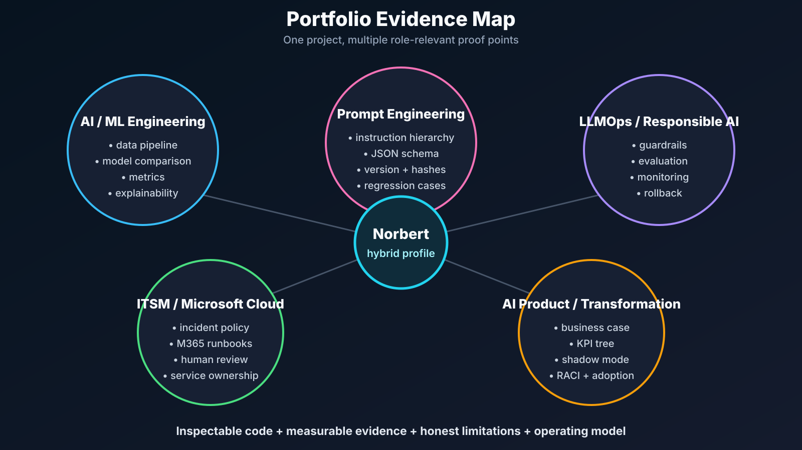
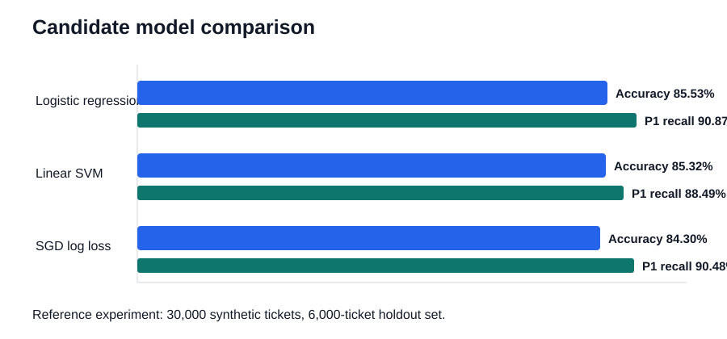
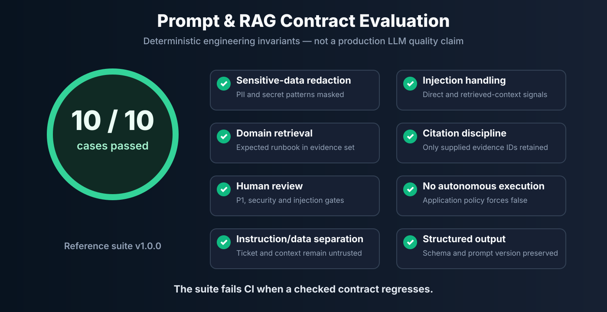

# AI-Powered IT Service Desk Copilot

[](https://github.com/spawn187/ai-it-service-desk-priority-predictor/actions/workflows/ci.yml)
[](https://www.python.org/)
[](https://scikit-learn.org/)
[](https://fastapi.tiangolo.com/)
[](https://streamlit.io/)
[](prompts/README.md)
[](docs/PROMPT_ENGINEERING.md)
[](docs/THREAT_MODEL.md)
[](LICENSE)

A portfolio-grade **hybrid AI/ML and prompt-engineering system** for IT service-management decision support. It combines a transparent NLP priority classifier with a guarded, retrieval-grounded Service Desk Copilot that produces structured, cited, human-approved first-response plans.

This repository is deliberately more than a notebook or a chatbot wrapper. It demonstrates the complete path from business problem and data design to ML evaluation, prompt versioning, RAG, injection defenses, schema validation, API delivery, observability design, CI quality gates, and an interview-ready operating model.

> **Privacy and honesty by design:** the repository contains no employer, employee, customer, host, or production service-desk data. Reference metrics are measured on reproducible synthetic data and are not presented as proof of production performance.


## What this project proves

| Capability | Inspectable evidence in the repository |
|---|---|
| Applied machine learning | Reproducible synthetic data, leakage-safe feature pipeline, candidate-model comparison, holdout evaluation, explainable inference |
| Prompt engineering | Instruction hierarchy, untrusted-input boundaries, strict JSON schema, versioned prompts, input/prompt hashes, change log |
| RAG | Local runbook retrieval, evidence IDs, source-constrained citations, weak-grounding review gate |
| LLM safety | PII and secret redaction, direct and indirect injection detection, citation filtering, policy re-application, no execution tools |
| LLMOps / MLOps | Automated tests, deterministic prompt regression suite, CI release gate, model metadata, monitoring and rollback design |
| AI product thinking | Business case, human operating model, measurable rollout stages, acceptance criteria, limitations and ownership |
| ITSM domain depth | P1-P4 prioritization, incident escalation, security handling, M365, Entra ID, Exchange Online, Intune, Windows 365, Teams and network runbooks |
| Communication | Technical report, model card, threat model, ADRs, demo script, Hungarian interview defense and job-application pack |



## Reference evidence

### Classical ML layer

The reproducible reference experiment uses **30,000 synthetic tickets** and a stratified **6,000-ticket holdout set**.

| Candidate | Accuracy | Macro F1 | P1 precision | P1 recall |
|---|---:|---:|---:|---:|
| **Balanced logistic regression** | **85.53%** | 83.16% | 70.90% | **90.87%** |
| SGD classifier | 84.30% | 81.36% | 69.30% | 90.48% |
| Linear SVM | 85.32% | **83.60%** | **75.85%** | 88.49% |

Logistic regression is selected because the operating objective is not to win one aggregate metric. It gives the strongest P1 recall among the high-performing candidates, native probabilities for confidence-based routing, inspectable coefficients, and inexpensive inference.



### Prompt/RAG contract layer

The checked-in regression suite contains **10 representative cases** covering seven IT domains, Hungarian and English input, direct prompt injection, PII and secret redaction, grounding, citation discipline, structured output, and mandatory human-review rules.

The current deterministic suite result is **10/10 passed**. This validates engineering invariants; it does **not** claim that a production LLM is perfect or that an offline fallback measures generative quality.



See [the evaluation methodology](docs/LLMOPS_EVALUATION.md) and the machine-readable [reference result](artifacts/prompt_eval_metrics.json).

## End-to-end workflow

1. **Validate the ticket contract.** Pydantic rejects missing, unexpected, or invalid fields.
2. **Redact sensitive content.** Common email, phone, employee-ID, password, token, and secret patterns are masked before retrieval or prompting.
3. **Detect prompt injection.** The application scans ticket text and retrieved context for direct and indirect instruction-hijacking signals.
4. **Predict priority.** A classical ML pipeline scores P1-P4 and returns class probabilities plus local feature contributions.
5. **Retrieve approved knowledge.** A transparent TF-IDF retriever selects relevant Markdown runbook sections and assigns evidence IDs.
6. **Build an auditable prompt package.** System, developer, and user/data layers remain separate; the response schema, prompt version, input hash, and prompt hash are preserved.
7. **Generate structured advice.** CI and offline demos use a deterministic adapter; an external structured-generation provider can be connected behind the same interface.
8. **Validate and re-apply policy.** Pydantic validates the response, invented citations are removed, `automation_allowed` is forced to `false`, and mandatory review rules override provider output.
9. **Return decision support.** The API and Streamlit page expose priority, confidence, guardrails, evidence, recommendations, escalation, assumptions, missing data, and policy decisions.

## Non-negotiable operating policy

- Every P1 prediction requires analyst confirmation.
- Every prediction below 65% confidence requires analyst review.
- Security, injection-flagged, weakly grounded, and context-injection cases require review.
- Retrieved content and ticket text are data, never executable instructions.
- Recommendations are advisory; the portfolio implementation has no execution tool.
- Destructive, privileged, identity, access, security, network, restart, isolation, deletion, or data-changing actions are never autonomous.
- A model or provider cannot weaken these controls because the application re-applies them after generation.

## Repository map

```text
.
├── api/                              # FastAPI: prediction and copilot endpoints
├── app/                              # Streamlit ML demo
│   └── pages/                        # Service Desk Copilot interactive page
├── artifacts/                        # Reproducible ML and prompt-eval evidence
├── assets/                           # Portfolio diagrams and evaluation visuals
├── data/sample/                      # Small inspectable synthetic sample
├── docs/
│   ├── adr/                          # Defensible architecture decisions
│   ├── ARCHITECTURE.md
│   ├── BUSINESS_CASE.md
│   ├── DEMO_SCRIPT.md
│   ├── INTERVIEW_DEFENSE_HU.md
│   ├── JOB_APPLICATION_PACK.md
│   ├── LLMOPS_EVALUATION.md
│   ├── MODEL_CARD.md
│   ├── PORTFOLIO_CASE_STUDY.md
│   ├── PROMPT_ENGINEERING.md
│   └── THREAT_MODEL.md
├── evals/                            # Prompt/RAG cases and manual rubric
├── examples/                         # API request and response examples
├── knowledge_base/runbooks/          # Version-controlled grounding corpus
├── models/                           # Generated model metadata and local binary
├── prompts/                          # Prompt, schema, examples and changelog
├── scripts/                          # Data, training, evaluation and demo CLIs
├── src/it_ticket_priority/
│   └── copilot/                      # Security, retrieval, prompting, adapters, evals
├── tests/                            # ML, API, prompt, RAG and guardrail tests
├── .github/workflows/ci.yml          # Lint, tests, prompt gate, training smoke test
├── Dockerfile
├── docker-compose.yml
└── pyproject.toml
```

## Quick start

```bash
git clone https://github.com/spawn187/ai-it-service-desk-priority-predictor.git
cd ai-it-service-desk-priority-predictor

python -m venv .venv
source .venv/bin/activate        # Linux/macOS
# .venv\Scripts\activate         # Windows PowerShell

python -m pip install --upgrade pip
python -m pip install -e ".[dev]"
```

### Reproduce the ML experiment

```bash
python scripts/generate_data.py --rows 30000 --seed 42
python scripts/train_model.py --data data/synthetic_tickets.csv
```

Training generates `models/priority_model.joblib` locally and refreshes the evaluation artifacts. The binary model is intentionally not committed: the project remains reproducible from source.

### Run the prompt/RAG quality gate

```bash
python scripts/run_prompt_evals.py --fail-on-regression
```

Expected reference output:

```text
Prompt contract evaluation: 10/10 passed (100.0%).
```

### Run the copilot offline

This path requires no API key and does not pretend that the deterministic adapter is an LLM. It proves the orchestration, controls, retrieval, schema, and audit trail.

```bash
python scripts/run_copilot_demo.py
```

### Run the API

```bash
uvicorn api.main:app --reload --host 0.0.0.0 --port 8000
```

Open `http://localhost:8000/docs` for interactive OpenAPI documentation.

Available routes:

- `POST /predict` — P1-P4 ML scoring and local feature contributions.
- `POST /copilot/triage` — complete guarded ML + RAG + prompt workflow.
- `GET /model-info` — version and training metadata.
- `GET /health` — service and model status.

Example:

```bash
curl -X POST "http://localhost:8000/copilot/triage" \
  -H "Content-Type: application/json" \
  --data @examples/copilot_request.json
```

### Run the Streamlit portfolio demo

```bash
streamlit run app/streamlit_app.py
```

Use the sidebar to switch between the priority predictor and **Service Desk Copilot** page.

### Run with Docker

Train the model once, then:

```bash
docker compose up --build
```

- API: `http://localhost:8000/docs`
- Streamlit: `http://localhost:8501`

## Prompt engineering as software engineering

The production prompt is not an isolated block of persuasive text. It is a versioned component with:

- explicit system-level non-negotiable rules;
- developer-level task and output constraints;
- serialized untrusted ticket and retrieved context;
- a generated JSON Schema contract;
- evidence-ID restrictions;
- deterministic input and prompt hashes;
- a prompt changelog and architecture decisions;
- regression cases that fail CI when controls drift;
- a provider-neutral adapter so an LLM can be replaced without bypassing policy.

Read [Prompt Engineering Design](docs/PROMPT_ENGINEERING.md) for the full rationale and weak-baseline comparison.

## Production deployment path

A real organization should not move directly from this repository to automatic ticket changes. The proposed rollout is:

1. **Offline validation** on approved, anonymized, temporally split historical data.
2. **Shadow mode** where the system scores tickets but changes no workflow.
3. **Analyst assist** with visible evidence, confidence, and mandatory confirmation.
4. **Constrained routing** for approved low-risk cases with audit logging and rollback.
5. **Continuous monitoring** for drift, override rate, false P1/P1 misses, citation quality, latency, cost, safety events, and user adoption.

The detailed ownership model, acceptance gates, SLOs, and rollback plan are in [LLMOps and Evaluation](docs/LLMOPS_EVALUATION.md), [Business Case](docs/BUSINESS_CASE.md), and [Threat Model](docs/THREAT_MODEL.md).

## Design choices that are easy to defend

### Why hybrid ML instead of asking an LLM for priority?

Priority is a small, auditable classification problem with structured metadata and asymmetric costs. A classical model is faster, cheaper, easier to validate, and gives stable probabilities. The generative layer focuses on the task where generation adds value: synthesizing a grounded first-response plan.

### Why local TF-IDF retrieval instead of a vector database?

The corpus is intentionally small and inspectable. A local retriever keeps the portfolio reproducible, makes scores transparent, requires no cloud bill, and avoids pretending that infrastructure scale exists before the use case requires it. The retrieval interface can later be replaced by hybrid or vector search.

### Why is automation always disabled?

The project demonstrates controlled decision support, not an autonomous operations agent. High-impact IT actions require identity, authorization, change control, auditability, rollback, environment-specific testing, and explicit ownership. Those controls cannot be replaced by a prompt.

### Why synthetic data?

Real tickets commonly contain personal, security, architecture, device, and operational information. Synthetic data permits public inspection and deterministic reproduction. The limitation is stated plainly: synthetic metrics do not establish production generalization.

See the decision records under [`docs/adr`](docs/adr/).

## Quality checks

```bash
ruff check .
pytest -q --cov=it_ticket_priority --cov-report=term-missing
python scripts/run_prompt_evals.py --fail-on-regression
```

GitHub Actions also runs a clean training smoke test so documentation cannot drift too far from executable behavior.

## Limitations

- ML reference metrics come from generated data, not a real organizational distribution.
- The local runbook corpus is intentionally small and curated.
- The deterministic assistant validates the engineering workflow, not open-ended LLM answer quality.
- Pattern-based injection and PII detection reduce risk but cannot guarantee complete detection.
- Provider-side content filters, identity, network isolation, key management, audit storage, and cost controls are deployment responsibilities.
- No recommendation is evidence that an action is correct for a specific production environment.
- The project is a portfolio reference implementation, not a deployed employer system.

## Interview-ready documentation

- [Portfolio case study](docs/PORTFOLIO_CASE_STUDY.md)
- [Prompt engineering design](docs/PROMPT_ENGINEERING.md)
- [LLMOps and evaluation](docs/LLMOPS_EVALUATION.md)
- [Threat model](docs/THREAT_MODEL.md)
- [System card](docs/SYSTEM_CARD.md)
- [Primary references](docs/REFERENCES.md)
- [Business case](docs/BUSINESS_CASE.md)
- [Live demo script](docs/DEMO_SCRIPT.md)
- [Hungarian defense guide](docs/INTERVIEW_DEFENSE_HU.md)
- [CV, LinkedIn and application pack](docs/JOB_APPLICATION_PACK.md)
- [Original ML interview talk track](docs/INTERVIEW_TALK_TRACK.md)
- [Model card](docs/MODEL_CARD.md)

## Author

**Norbert Komaromi** — IT operations, Microsoft cloud, IT service management, automation, AI transformation, applied AI/ML and prompt-engineering portfolio.

This project intentionally connects domain experience in incident, problem, change, M365, Entra ID, Intune, Windows 365, security governance, service adoption and stakeholder communication with implementable AI engineering.

GitHub: [spawn187](https://github.com/spawn187)

## License

Released under the [MIT License](LICENSE).
