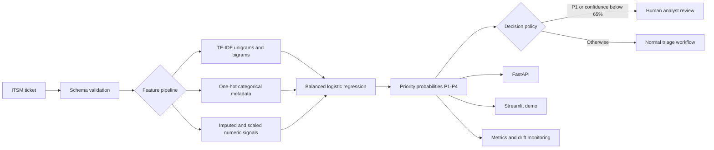

# AI-Powered IT Service Desk Priority Predictor

[](https://github.com/spawn187/ai-it-service-desk-priority-predictor/actions/workflows/ci.yml)
[](https://www.python.org/)
[](https://scikit-learn.org/)
[](https://fastapi.tiangolo.com/)
[](https://www.docker.com/)
[](LICENSE)

An end-to-end machine learning engineering portfolio project that predicts **P1-P4 priority** for IT service desk tickets using free-text descriptions and operational metadata.

The project is deliberately built as more than a notebook. It includes reproducible synthetic data generation, preprocessing, feature engineering, model comparison, explainable inference, a FastAPI service, a Streamlit demo, Docker, tests, CI, experiment tracking support, a model card, and an interview talk track.

> **Data safety:** the repository contains no real company, employee, customer, or ticket data. All records are reproducibly generated synthetic examples.

## Business problem

Manual ticket prioritization is slow and inconsistent. A genuine outage or security incident assigned as P3 can delay escalation and breach an SLA, while excessive P1 assignments create alert fatigue and waste specialist capacity.

This solution supports analysts by estimating ticket priority from:

- the ticket description;
- category and submission channel;
- service criticality and site;
- number of affected users;
- outage, security, VIP, and business-hours indicators;
- recent related-incident volume.

The production decision policy is intentionally conservative: **every predicted P1 and every low-confidence prediction requires human review**.

## Reproducible results

The committed model was trained from a deterministic **30,000-ticket synthetic dataset**. The generator also inserted 180 duplicate rows to test the cleaning pipeline; these were removed before modeling. The final split contained 24,000 training and 6,000 holdout records.

| Model | Accuracy | Macro F1 | P1 precision | P1 recall |
|---|---:|---:|---:|---:|
| **Balanced logistic regression** | **85.53%** | 83.16% | 70.90% | **90.87%** |
| SGD classifier | 84.30% | 81.36% | 69.30% | 90.48% |
| Linear SVM | 85.32% | **83.60%** | **75.85%** | 88.49% |

Logistic regression was selected even though the linear SVM achieved a slightly higher macro F1-score. The production choice provides:

1. the strongest P1 recall among the high-performing candidates;
2. native class probabilities for confidence-based routing;
3. inspectable coefficients for local explanations;
4. low inference latency and modest infrastructure cost;
5. a simpler operational path than a transformer model.


## Example prediction

A mission-critical warehouse outage is predicted as **P1**, accompanied by class probabilities, a human-review flag, and the strongest positive feature contributions.


```json
{
  "predicted_priority": "P1",
  "confidence": 0.9962,
  "requires_human_review": true,
  "top_contributors": [
    {"feature": "numeric: outage indicator", "contribution": 3.3143},
    {"feature": "numeric: affected users", "contribution": 2.2231},
    {
      "feature": "metadata: service criticality mission critical",
      "contribution": 2.0723
    }
  ]
}
```

## Architecture



See [docs/ARCHITECTURE.md](docs/ARCHITECTURE.md) for the component and production deployment design.

## Repository structure

```text
.
├── api/                         # FastAPI service
├── app/                         # Streamlit interactive demo
├── artifacts/                   # Metrics, comparisons, experiment records
├── assets/                      # Evaluation and portfolio visuals
├── data/sample/                 # Small inspectable data sample
├── docs/                        # Architecture, report, model card, interview notes
├── examples/                    # API request and response examples
├── models/                      # Serialized production pipeline and metadata
├── notebooks/                   # Exploratory analysis notebook
├── scripts/                     # Data, training, evaluation, prediction CLIs
├── src/it_ticket_priority/      # Reusable Python package
├── tests/                       # Generator, model, inference, and API tests
├── .github/workflows/ci.yml     # Lint, tests, coverage, training smoke test
├── Dockerfile
├── docker-compose.yml
├── Makefile
└── pyproject.toml
```

## Quick start

### 1. Clone and create an environment

```bash
git clone https://github.com/spawn187/ai-it-service-desk-priority-predictor.git
cd ai-it-service-desk-priority-predictor

python -m venv .venv
source .venv/bin/activate        # Linux/macOS
# .venv\Scripts\activate         # Windows PowerShell

python -m pip install --upgrade pip
python -m pip install -e ".[dev]"
```

The repository already includes a trained synthetic-data model. A local prediction can be executed immediately:

```bash
python scripts/predict_example.py
```

### 2. Reproduce the full experiment

```bash
python scripts/generate_data.py --rows 30000
python scripts/train_model.py --data data/synthetic_tickets.csv
```

Convenience targets are also available:

```bash
make data
make train
make test
```

### 3. Run the API

```bash
uvicorn api.main:app --reload --host 0.0.0.0 --port 8000
```

Open the interactive OpenAPI documentation at `http://localhost:8000/docs`.

```bash
curl -X POST "http://localhost:8000/predict" \
  -H "Content-Type: application/json" \
  --data @examples/api_request.json
```

Available endpoints:

| Endpoint | Method | Purpose |
|---|---|---|
| `/health` | GET | Readiness and model-load status |
| `/model-info` | GET | Model metadata, metrics, schema, and runtime |
| `/predict` | POST | Priority prediction and explanation |
| `/docs` | GET | Interactive OpenAPI documentation |

### 4. Run the Streamlit dashboard

```bash
streamlit run app/streamlit_app.py
```

Open `http://localhost:8501` and enter a ticket interactively.

### 5. Run with Docker

```bash
docker compose up --build
```

- API: `http://localhost:8000/docs`
- Dashboard: `http://localhost:8501`

## ML workflow

### Synthetic data generation

The generator creates realistic but fictional tickets with configurable missingness, duplicates, typographical noise, class imbalance, and imperfect relationships between text and labels. This prevents the portfolio from depending on confidential ticket exports and makes every result reproducible from seed `42`.

### Data quality controls

- required-column validation;
- duplicate removal;
- target-label validation;
- empty-text handling;
- categorical fallback values;
- median numerical imputation;
- leakage review and explicit feature contract.

### Feature engineering

- TF-IDF word unigrams and bigrams for ticket text;
- one-hot encoding for category, channel, service criticality, and site;
- imputation and scaling for numerical and Boolean operational features;
- a single scikit-learn `Pipeline` and `ColumnTransformer` to prevent train/test preprocessing leakage.

### Model training and selection

The training process compares logistic regression, linear SVM, and SGD classification. Logistic-regression regularization is selected through three-fold stratified cross-validation using a business-oriented combination of P1 recall and macro F1.

Class weights approximately compensate for the imbalanced priority distribution and add an extra penalty for missed P1 incidents. This is deliberate: a missed critical outage is usually more costly than an unnecessary analyst review.

### Explainability

For the selected logistic-regression class, the API multiplies the transformed input values by the relevant model coefficients and returns the largest positive local contributions. This is not a causal explanation, but it provides a useful operational reason trace for analysts and interview demonstrations.

### MLOps foundations

- serialized preprocessing-and-model pipeline with `joblib`;
- model metadata, data-quality report, metrics, and comparison artifacts;
- optional MLflow logging through `MLFLOW_TRACKING_URI`;
- API health and model-information endpoints;
- Dockerized API and dashboard;
- GitHub Actions linting, tests, coverage, and training smoke test;
- documented production monitoring and retraining strategy.

To enable MLflow:

```bash
python -m pip install -r requirements-mlflow.txt
export MLFLOW_TRACKING_URI=http://localhost:5000
python scripts/train_model.py --rows 30000
```

## Testing and quality

```bash
pytest -q --cov=it_ticket_priority --cov-report=term-missing
ruff check .
```

The test suite covers:

- deterministic synthetic-data generation;
- class distribution and schema validation;
- duplicate removal;
- end-to-end pipeline training;
- probability and explanation output;
- FastAPI request validation and prediction.

## Production hardening roadmap

This repository demonstrates an engineering pattern, not a production authorization to auto-prioritize real incidents. A real implementation would require:

- anonymized historical ticket validation and label-quality analysis;
- probability calibration and threshold testing by business cost;
- role-based access, API authentication, rate limits, and audit logging;
- PII detection and redaction before model input or storage;
- multilingual and site-specific evaluation;
- shadow-mode deployment before workflow automation;
- drift monitoring for text, features, predictions, and analyst overrides;
- rollback, model registry, canary deployment, and periodic retraining;
- security, privacy, legal, and change-management approval.

## Documentation

- [Technical report](docs/TECHNICAL_REPORT.md)
- [Architecture and deployment design](docs/ARCHITECTURE.md)
- [Model card](docs/MODEL_CARD.md)
- [Data dictionary](docs/DATA_DICTIONARY.md)
- [Interview talk track](docs/INTERVIEW_TALK_TRACK.md)
- [Roadmap](docs/ROADMAP.md)

## Limitations

- Metrics are measured on generated data, not on a real production distribution.
- The synthetic language is less varied than genuine service-desk text.
- Feature contributions explain model mechanics, not causality.
- The model does not replace incident-management judgment.
- P1 precision is intentionally lower than P1 recall because the system is designed to prefer review over a missed critical incident.

## Author

**Norbert Komaromi** — IT operations, cloud, automation, service management, and applied AI/ML portfolio project.

GitHub: [spawn187](https://github.com/spawn187)

## License

Released under the [MIT License](LICENSE).
