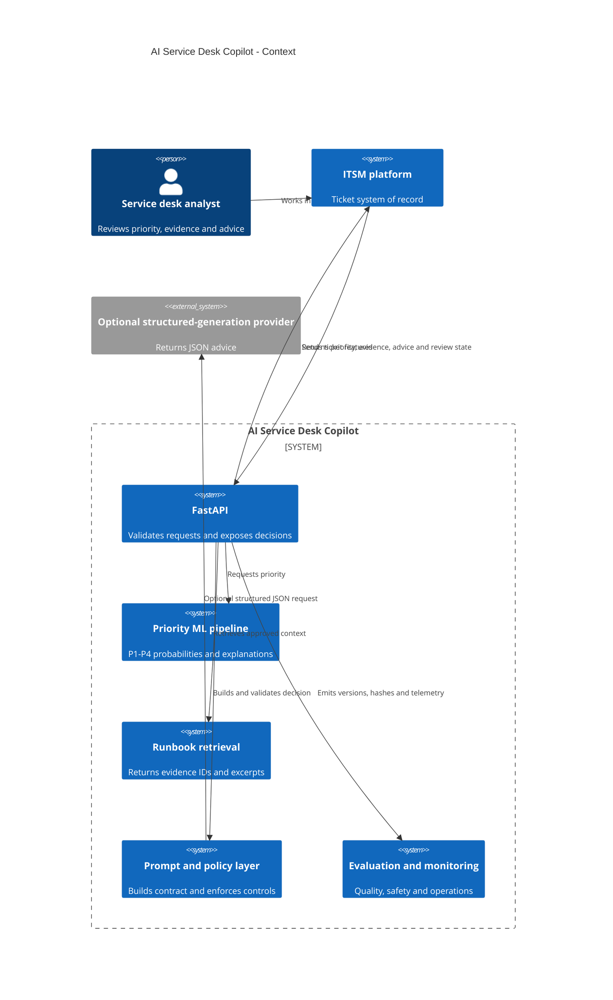
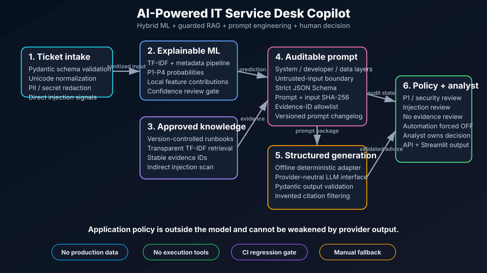
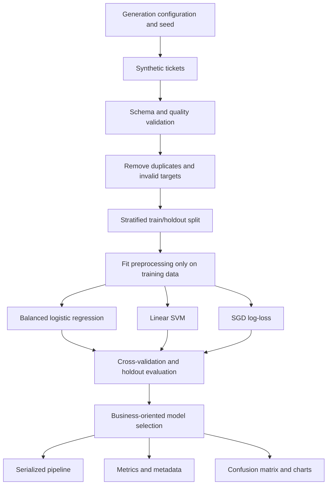
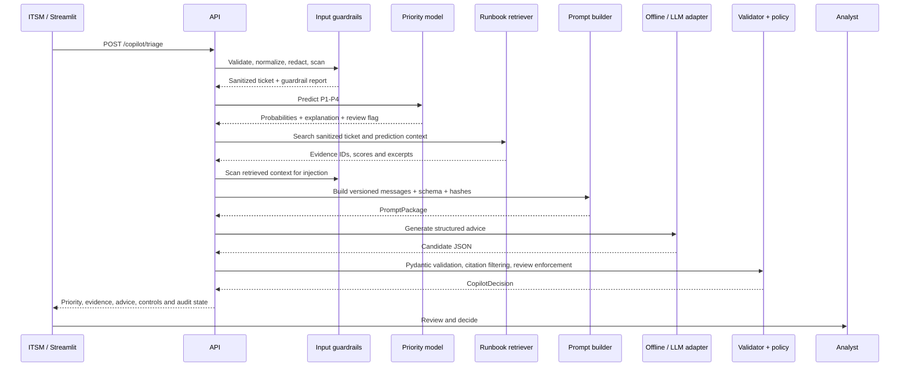

# Architecture and Deployment Design

## 1. System context

The application is a human-in-the-loop decision-support component for an IT service-management workflow. It accepts a newly created ticket, validates and sanitizes the request, predicts P1-P4 priority, retrieves approved runbook evidence, constructs an auditable prompt package, validates generated advice, re-applies application policy, and returns a structured decision to an analyst or ITSM platform.

The solution does not close, route, escalate, restart, isolate, disable, delete, or otherwise change a production service. The ITSM platform remains the system of record and the analyst or incident manager remains the decision-maker.

## 2. Design principles

- **Application-owned policy:** provider output cannot enable automation or suppress mandatory review.
- **Least agency:** no execution tools are attached.
- **Privacy by design:** no real employer data is committed; sensitive patterns are redacted before prompting.
- **Separation of concerns:** classification, retrieval, prompting, generation, policy, and presentation are independent components.
- **Structured contracts:** request and response models are validated by Pydantic.
- **Evidence over fluency:** recommendations cite retrieved runbook evidence IDs.
- **Reproducibility:** synthetic data, local retrieval, offline fallback, prompt hashes, and CI tests.
- **Honest evaluation:** synthetic and deterministic results are labeled with their limits.
- **Manual continuity:** service-desk work can continue without AI components.

## 3. Component architecture

| Component | Responsibility |
|---|---|
| `data_generator.py` | Produces deterministic synthetic tickets with imbalance, noise, missingness, and duplicates. |
| `data_validation.py` | Enforces the ML feature contract and returns data-quality evidence. |
| `pipeline.py` | Builds leakage-safe text, categorical, numeric, and classifier transformations. |
| `train.py` | Splits data, compares candidates, evaluates, persists artifacts, and logs runs. |
| `inference.py` | Loads the classifier and returns probabilities, review policy, and local contributions. |
| `copilot/security.py` | Normalizes input, redacts sensitive patterns, and detects injection signals. |
| `copilot/retrieval.py` | Indexes Markdown runbook sections and returns stable evidence IDs. |
| `copilot/prompting.py` | Builds versioned system/developer/data messages, schema, and hashes. |
| `copilot/assistant.py` | Provides deterministic fallback and provider-neutral structured adapter. |
| `copilot/orchestrator.py` | Coordinates the full workflow and re-applies application policy. |
| `copilot/evaluation.py` | Runs deterministic prompt/RAG regression cases. |
| `api/main.py` | Exposes health, metadata, prediction, and copilot endpoints. |
| `app/` | Provides interview-friendly Streamlit demonstrations. |
| `knowledge_base/runbooks/` | Contains representative, version-controlled grounding content. |
| `prompts/` | Contains the prompt, schema, examples, baseline, and changelog. |
| `tests/` | Covers ML, API, security, retrieval, prompting, orchestration, and policy. |

## 4. Training architecture

### Leakage controls

- Split before fitting TF-IDF, encoding, imputation, or scaling.
- Keep all transformations in one scikit-learn `Pipeline` and `ColumnTransformer`.
- Exclude post-prioritization fields such as resolution, SLA outcome, and override.
- Preserve the same serialized preprocessing for inference.
- Require temporal validation before a real deployment.

## 5. Copilot request flow

## 6. Trust boundaries

### Ticket boundary

Ticket text is user-controlled and may contain secrets, personal data, malformed Unicode, prompt injection, or misleading operational claims. It is validated and sanitized before retrieval or prompting.

### Knowledge boundary

Runbooks are version-controlled but still treated as untrusted runtime content. Retrieved fragments are scanned for instruction-like injection signals before inclusion.

### Provider boundary

An external model/provider is not trusted to enforce policy. It receives a constrained prompt and schema; its response is validated and policy-critical fields are re-applied outside the model.

### Analyst boundary

The analyst receives evidence, confidence, missing information, and policy decisions. The UI must not imply that the output is authoritative or that an action was executed.

## 7. Prompt package and lineage

Every prompt package includes:

- prompt ID and semantic version;
- system, developer, and user/data messages;
- response JSON Schema;
- allowed evidence IDs;
- SHA-256 of sanitized effective input;
- SHA-256 of version, messages, and schema.

A production audit event should also include application commit, model artifact, corpus version, retriever configuration, provider deployment, request ID, reviewer action, and timestamps.

## 8. Decision policy

Mandatory analyst review is applied when any of the following is true:

- predicted priority is P1;
- model confidence is below 65%;
- the ticket has a security indicator;
- direct or indirect prompt-injection signal is detected;
- no sufficiently relevant runbook evidence is retrieved.

In all cases:

- recommendations are advisory;
- actions require approval;
- `automation_allowed` is false;
- provider output cannot weaken these rules.

The 65% threshold is a transparent portfolio default, not a production-calibrated universal value.

## 9. API contracts

### `POST /predict`

Returns:

- predicted priority;
- confidence;
- P1-P4 probabilities;
- human-review flag;
- top positive feature contributions;
- model version.

### `POST /copilot/triage`

Returns:

- ML prediction;
- guardrail report;
- retrieved evidence;
- structured advice;
- prompt package and hashes;
- application policy decisions.

### System endpoints

- `GET /health`
- `GET /model-info`
- `GET /`

## 10. Local and container deployment

The supplied Docker image copies the complete repository, installs the package, and can run the API or Streamlit dashboard. `docker-compose.yml` starts both interfaces.

The model binary is generated locally before runtime. In production, immutable approved artifacts should come from a model registry rather than being built ad hoc or stored in a mutable container layer.

## 11. Azure-oriented production mapping

| Concern | Possible implementation |
|---|---|
| Training and registry | Azure Machine Learning and MLflow-compatible tracking |
| Online API | Azure Container Apps, AKS, or approved managed endpoint |
| Generative provider | Microsoft Foundry / Azure OpenAI structured output deployment |
| Retrieval | Azure AI Search with tenant/document authorization and hybrid ranking |
| Identity | Microsoft Entra workload identity and OAuth2/OIDC |
| Secrets | Azure Key Vault |
| Network | Private endpoints, VNet integration, approved egress |
| Telemetry | Application Insights, Azure Monitor, structured traces |
| Audit and data | Restricted, encrypted, versioned storage |
| Integration | Queue or Service Bus between ITSM and workers |
| CI/CD | GitHub Actions with federated identity and environment approval |
| Policy | Application policy service and organization change controls |

This is a logical mapping, not a claim that the portfolio is already deployed in Azure.

## 12. Production topology

A production topology should separate:

- public or internal ingress;
- authenticated API;
- prediction service;
- retrieval service;
- generation provider adapter;
- policy and audit layer;
- UI / ITSM integration;
- model and prompt registries;
- knowledge repository;
- observability pipeline.

Each component should have independent versioning, least-privilege identity, health checks, SLOs, and rollback.

## 13. Reliability and graceful degradation

Recommended behavior:

- if the generative provider fails, return ML prediction and evidence or use an approved fallback;
- if retrieval fails, force review and state that no evidence is available;
- if the ML model fails, retain manual priority assignment;
- if the complete AI service fails, ticket creation and manual triage continue;
- never block a critical incident solely because an AI dependency is unavailable.

Use timeouts, retries with bounds, circuit breaking, queues where needed, health probes, idempotent requests, and replayable integration messages.

## 14. Monitoring

### Runtime

- availability, request rate, error rate, and latency percentiles;
- model/provider load and timeout status;
- fallback use;
- resource saturation;
- cost and token consumption.

### Input and safety

- validation failures;
- input length and truncation;
- redaction count and type;
- direct/indirect injection signal rate;
- category, site, language, and impact distribution.

### Retrieval

- top score and score distribution;
- no-evidence rate;
- document selection distribution;
- expected-domain recall on sampled labeled cases;
- runbook freshness and ownership.

### ML and generative quality

- priority and confidence distribution;
- delayed accuracy, macro F1, P1 precision and recall;
- calibration and analyst override;
- schema success;
- citation relevance;
- unsupported-claim and prohibited-action rates;
- acceptance, edit, and rejection rate.

### Business

- time to correct priority;
- time to first useful response;
- reassignment and escalation delay;
- runbook adoption;
- analyst satisfaction and trust calibration;
- adoption and cost per assisted ticket.

## 15. Security and privacy

See `THREAT_MODEL.md`. Production controls include authentication, authorization, DLP, data minimization, private networking, encrypted storage, approved retention, managed secrets, signed artifacts, dependency and image scanning, audit integration, provider contracts, and incident response.

## 16. Release and rollback

Independent rollback units:

- application version;
- ML model artifact;
- prompt version;
- response schema;
- runbook corpus;
- retriever configuration;
- provider deployment.

Release progression:

1. offline benchmark;
2. shadow mode;
3. analyst assist;
4. constrained approved integration;
5. operational service with monitoring and change control.

Manual service-desk operation is the continuity path at every stage.
