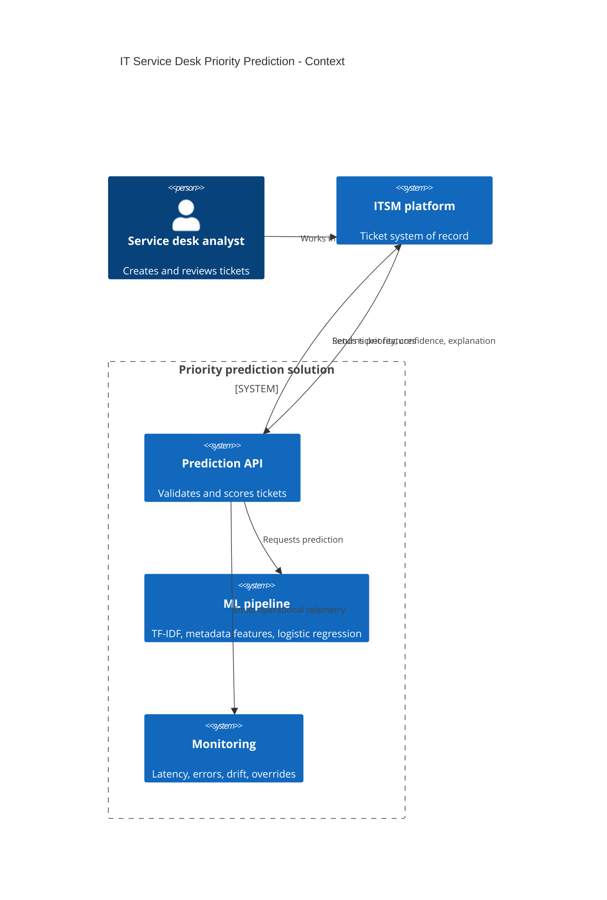
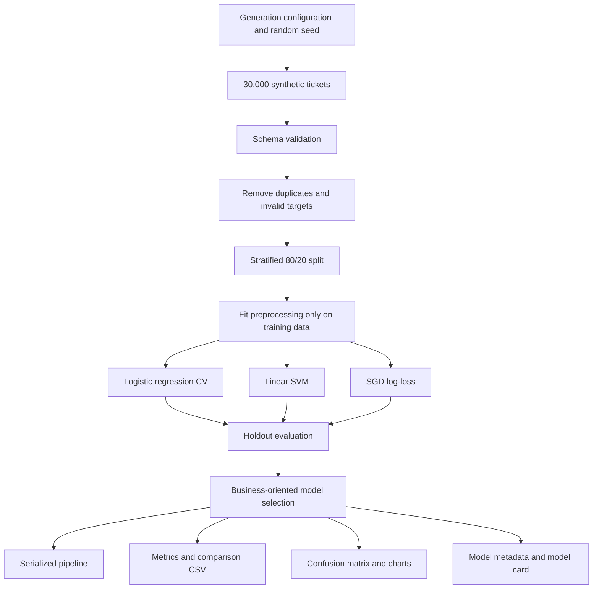
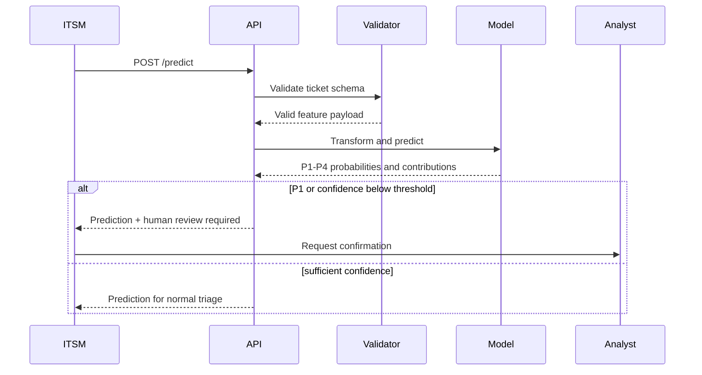

# Architecture and Deployment Design

## 1. System context

The application is a decision-support component for an IT service management workflow. It accepts a newly created ticket, validates the request schema, transforms text and metadata through the same pipeline used during training, and returns a predicted priority from P1 to P4. The response also contains class probabilities, a human-review flag, and local feature contributions.

The model does not directly close, route, or escalate tickets. In the intended operating model, the ITSM platform or service desk analyst remains the system of record and final decision-maker.

## 2. Repository component architecture

| Component | Responsibility |
|---|---|
| `data_generator.py` | Produces deterministic synthetic tickets with imbalance, noise, missingness, and duplicates. |
| `data_validation.py` | Enforces the feature contract and returns a data-quality report. |
| `pipeline.py` | Builds the leakage-safe text, categorical, numeric, and classifier pipeline. |
| `train.py` | Runs the split, cross-validation, candidate comparison, persistence, plots, and experiment logging. |
| `inference.py` | Loads the artifact and returns probabilities, review policy, and local contributions. |
| `api/main.py` | Exposes health, metadata, and prediction endpoints. |
| `app/streamlit_app.py` | Provides an interview-friendly interactive demonstration. |
| `tracking.py` | Logs runs to MLflow when configured, otherwise to local JSON. |
| `tests/` | Covers generation, quality, training, inference, and API behavior. |

## 3. Training flow

### Leakage controls

The train/test split happens before fitting TF-IDF, categorical encoding, numerical imputation, or scaling. All feature transformation is encapsulated in a scikit-learn `Pipeline` and `ColumnTransformer`. Post-prioritization information, analyst notes, resolution codes, and SLA outcomes are deliberately excluded because they would not exist at prediction time.

## 4. Inference flow

1. The client submits a ticket to `POST /predict`.
2. Pydantic validates types, ranges, string lengths, and unexpected fields.
3. The serialized pipeline transforms the request.
4. Logistic regression returns class probabilities.
5. The highest-probability class becomes the proposed priority.
6. The decision policy sets `requires_human_review=true` when:
   - the proposed priority is P1; or
   - maximum probability is below 0.65.
7. Coefficient-based local feature contributions are calculated for the predicted class.
8. The API returns a structured response.

## 5. Container deployment

The supplied Docker image contains the Python package, model artifact, API, and dashboard. `docker-compose.yml` runs two services from the same image:

- `api`: FastAPI on port 8000;
- `dashboard`: Streamlit on port 8501.

The API service includes a health check. In a production build, the dashboard and API should be independently versioned and scaled, and the model artifact should be obtained from an approved model registry rather than baked into every image.

## 6. Azure-oriented production mapping

A production implementation could map the repository components to the following logical services:

| Concern | Possible implementation |
|---|---|
| Model training and registry | Azure Machine Learning workspace and model registry |
| Online inference | Managed online endpoint, Azure Container Apps, or AKS depending on scale and governance |
| API identity | Microsoft Entra ID workload identity and OAuth 2.0 |
| Secrets | Azure Key Vault |
| Telemetry | Application Insights and Azure Monitor |
| Data and artifacts | Versioned object storage with restricted access |
| Asynchronous integration | Queue or service bus between ITSM and prediction workers |
| CI/CD | GitHub Actions with environment approvals and federated identity |
| Experiment tracking | MLflow-compatible tracking backend |

This is an architectural option, not a claim that the portfolio repository is already deployed in Azure.

## 7. Monitoring design

### Service health

- request count and success rate;
- P50, P95, and P99 latency;
- container restarts and resource saturation;
- schema-validation and inference errors;
- model-load status and version.

### Model behavior

- input missingness and schema changes;
- text-length and vocabulary drift;
- category, site, and service-criticality distribution drift;
- predicted-priority distribution;
- confidence distribution;
- analyst override rate;
- delayed accuracy, macro F1, P1 precision, and P1 recall when labels arrive.

### Alert examples

- P1 recall below the agreed threshold over a minimum labeled sample;
- analyst override rate increasing materially from baseline;
- confidence distribution shifting downward;
- unexpected spike in P1 predictions;
- feature or text drift beyond the approved limit;
- API latency or error rate exceeding the service objective.

## 8. Security and privacy

A real implementation must assume that ticket descriptions can contain names, email addresses, device identifiers, IP addresses, screenshots, and sensitive incident details. Production controls should therefore include:

- PII and secret redaction before logging or training;
- encryption in transit and at rest;
- least-privilege access to data, artifacts, and endpoints;
- API authentication and authorization;
- rate limiting and payload-size limits;
- audit records for predictions, analyst decisions, and model versions;
- retention and deletion policies;
- dependency, image, and source-code scanning;
- threat modeling for data poisoning, prompt-like text manipulation, and model extraction.

## 9. Reliability and rollback

The ITSM system should remain functional when the prediction service is unavailable. The recommended behavior is to fall back to manual prioritization rather than block ticket creation. Deployments should support:

- immutable model and image versions;
- canary or shadow deployment;
- fast rollback to the last approved artifact;
- replayable integration messages;
- idempotent prediction requests;
- health probes and circuit breaking;
- a documented manual override path.
